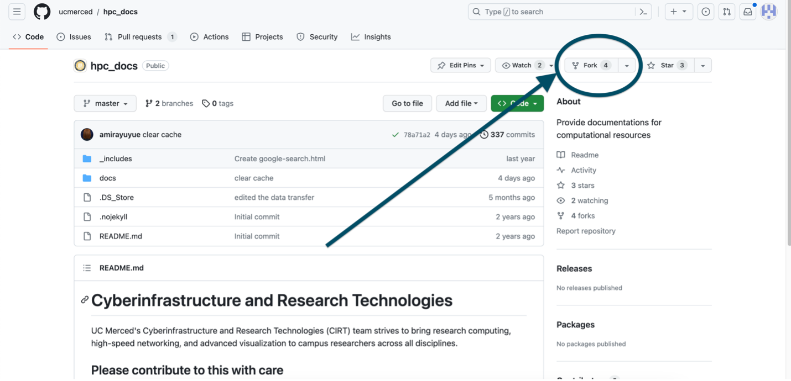
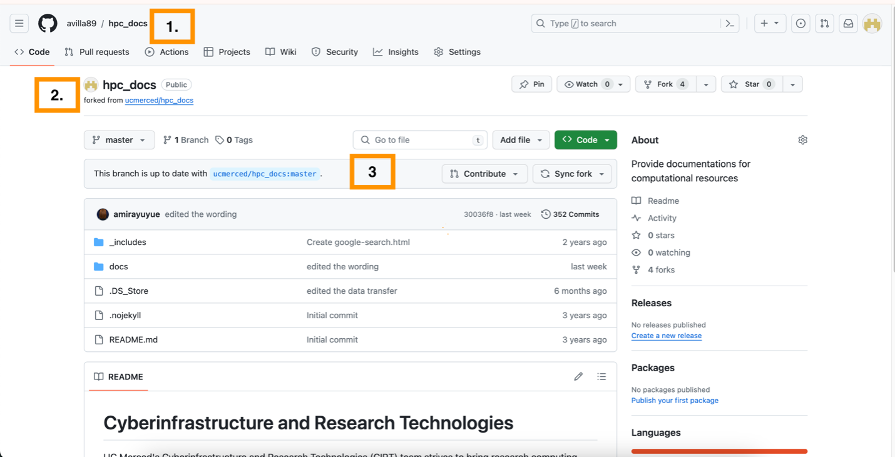
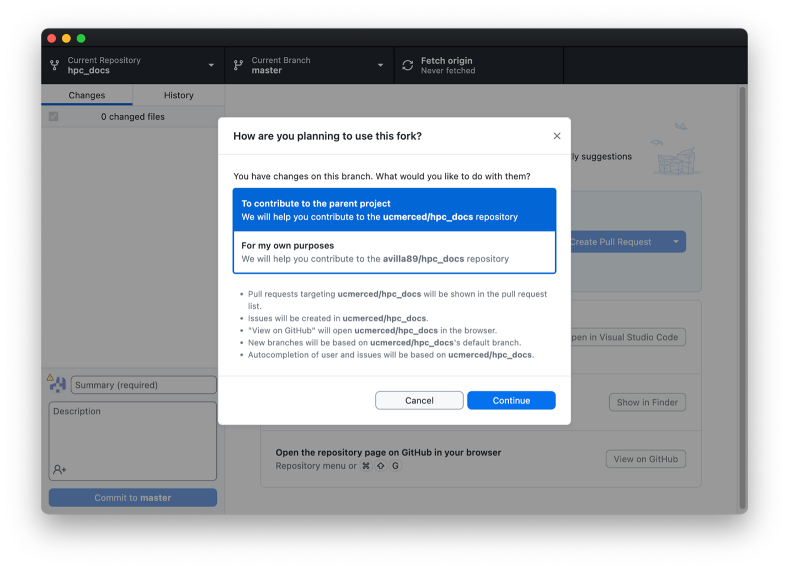
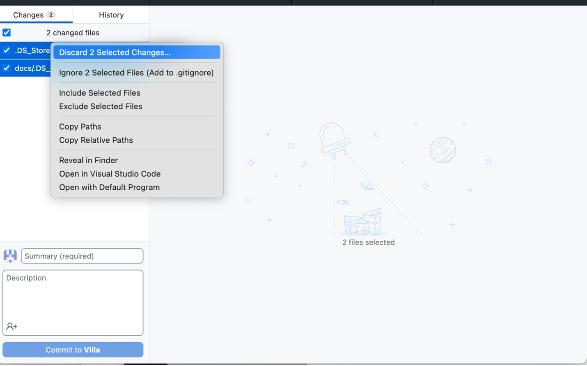
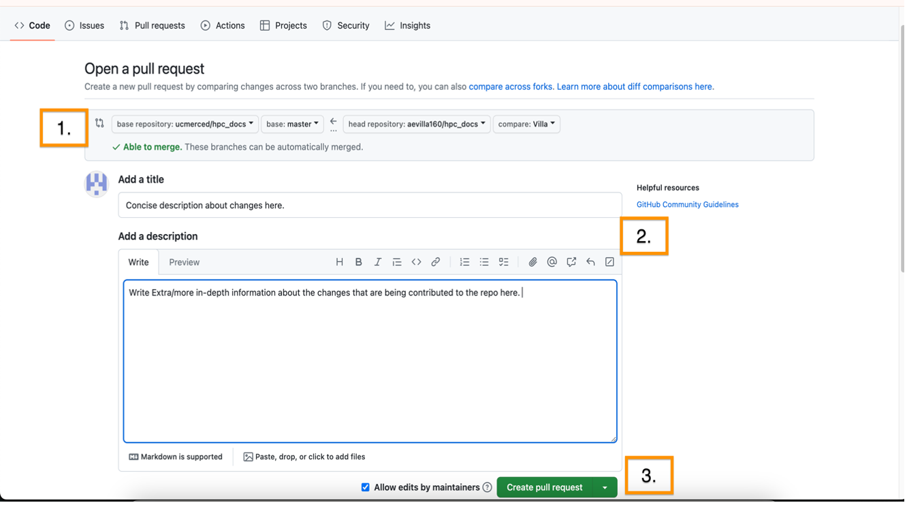
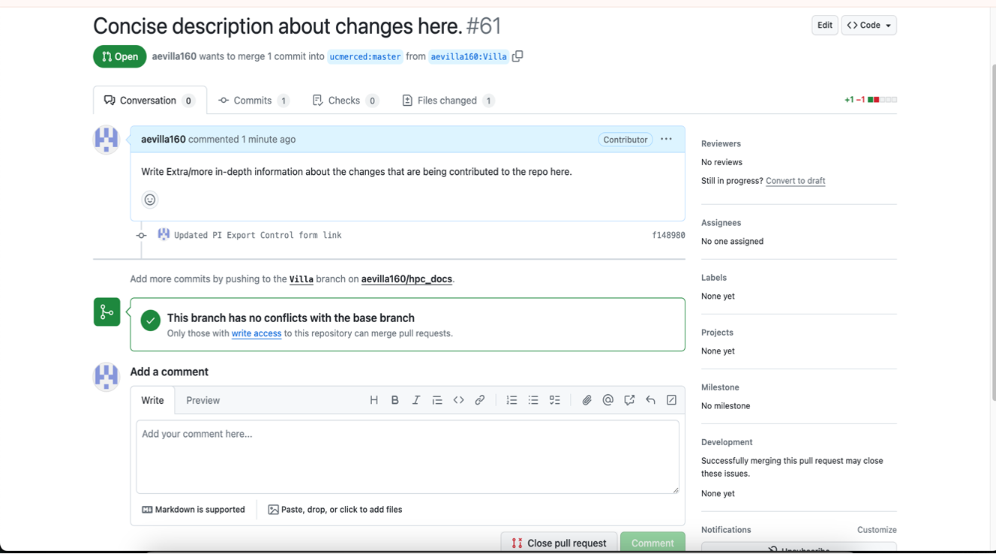

**Note**: This page serves as a guide for newcomers on how to contribute to UC Merced’s High Performance Computing documentation site.

### Prerequisites 
Prerequisites:  
1. Having a Github account  
2. Fundamental knowledge of GIT source control  
	- Good starting point for novices([https://swcarpentry.github.io/git-novice/](https://swcarpentry.github.io/git-novice/))  
3. Knowledge on any aspects of High-Performance Computing 
    

Good starting point for novices([https://www.hpc-carpentry.org/hpc-python/](https://www.hpc-carpentry.org/hpc-python/))

### How to get a Github Account:
1. Go to [https://github.com/](https://github.com/)
2. Click on the top right corner button labeled `Sign Up`

3. Follow the Sign-Up instructions to create an account!
- This should complete the Github signup process. 

## Accessing HPC Documentation Github

There are a few ways on how to access the repository such as clicking the top right corner of the HPC docs site or using the direct link.

**Useful Links**:   

High Performance Computing Documentation Site: [https://ucmerced.github.io/hpc_docs/#/](https://ucm-it.github.io/hpc_docs/#/) 

High Performance Computing Documentation REPO: [https://github.com/amirayuyue/hpc_doc_new](https://github.com/aevilla160/hpc_doc_new)

## Forking Repository

**Note**: To properly contribute to the documentation site please fork the original repository.
1. Navigate the HPC Docs [repo](https://github.com/ucm-it/hpc_docs)
2. Click `Fork` Button to fork the repo

3. Fill out the appropriate information. Feel free to change the name of the fork. ![[Pasted image 20241203103829.png]]
	- Ensure the **Copy the master branch only** box is selected as other branches may not be up to date.
	- Once all information has been filled out, click `Create Fork`
4. Now that the fork repository should be created, a screen will appear as follows: 
	1. Confirm that the repo you are looking at states: `<yourusername>/hpc_docs_new`
		- Note: if you changed the repository names in the process of creating the fork that name will reflect in place of **hpc_docs.**
	2. Ensure that it states “forked from **ucmerced/hpc_docs**”
	3. Ensure, that branch is up to data. If the branch is not, click sync fork to become up to date with the official branch.
5. Clone the repo on your computer. There are 2 ways to do this:
	1. Clone via command line interface
	2. Clone via the **_Github Desktop_** application(preferred and steps are listed below)
### Github Desktop Cloning 
1. Ensure the fork is up to date with the main repository.
2. Click on the **Code** button to open a drop down menu
3. Click on **Open with Github Desktop**
**Note** : Github Desktop must be downloaded and set up before this step to avoid issues
**It should now open the repository on local machine via Github Desktop**
5. In Github Desktop, there will be a pop up. Select “**To contribute to the parent project”**

7. Once the folder and it’s files have been successfully pulled onto the local machine, you can now begin to make edits in your local copy and every change saved should now be reflected on the GIT change log.
8. Occasionally, there will be additional files that were **changed indirectly,** as a result of other files changing. These files are:
	1. `DS_Store`
	2. `docs/.DS_Store`
****_Do not commit these changed files._** Rather, right-click on them and discard their changes. See Below:

9. Finalize your changes, you may now send a formal request to have your additions reflected on the official HPC repo via a GIT Pull Request.  Submitting a pull request can be done after committing your changes and ensuring you have properly synced with the **hpc_docs_new** repository
10. The following will showcase how to submit a pull request via **GitHub Desktop**

1. Ensure you have the correct repository selected and opened.
2. Ensure you have selected the correct branch that your changes are on.
3. Ensure you have fetched and pulled all changes that are waiting on the remote Branch of your fork.
	- Remember to ensure your branch is synced with the official **hpc_docs** repository!
11. Select the `Create Pull Request` button to open a browser tab that will allow you to confirm your changes you are wanting to merge into the official repo.

	1. Ensure the pull request is being created out of the correct branch (right side of arrow). As well, ensure that you are trying to contribute to the “Master” branch of the **ucmerced/hpc_docs**.
	2.    Add a title and description in the following boxes.
	3.    Once done with formulating your pull request, select “Create pull request” in the lower left side. This will confirm and send your pull request to the maintainers of the **ucmerced/hpc_docs** repository.
1.    The confirmation screen should look similar to:

1. If you need to close out the pull request, it can be done here.
2. The newly created pull request will also have a number to track the status of the pull request.
### This Concludes How to Contribute to the **ucmerced/hpc_docs_new**repository.
