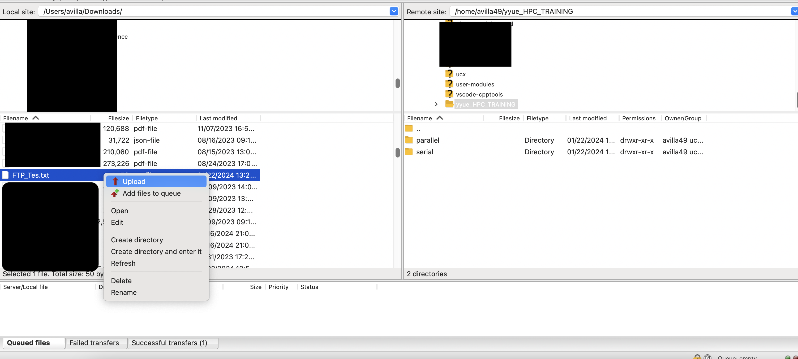

This page presents ways to transfer and share data with other users on the HPC clusters. Note that the word "group" on this page always refers to Unix groups.


## Data Transfer
There are many ways to transfer data between the cluster and local workspaces. Below are instructions and descriptions of two common methods of data transfer to and from the HPC cluster. 

Most casual and regular amounts of data transferring can be done through the `rc` login node, by pointing your transfer tool to `login.rc.ucmerced.edu` and can be done via one of the methods shown below. 

However, for transferring large amounts of data, FIONAs with dedicated bandwidths can be used for scheduled, unattended data transfers. If you are looking to complete a Big Data transfer, please submit a general research request [here](https://ucmerced.service-now.com/servicehub?id=public_kb_article&sys_id=3c3ee9ff1b67a0543a003112cd4bcb13&form_id=06da3f8edbfc08103c4d56f3ce9619f4).

### `scp` Command
The `scp` command is useful as it is an easy and versatile command that allows for two-way transfering of data. It does not require any setup to use and is great for constantly transferring different and separate files or directories. `scp` is a linear and basic copy and transfer of data; therefore, it does not have any failsafes to prevent data loss or data corruption. `scp` is generally used for simple files/directories and small, compressed files.

List of relevant options that can be used with SCP: 

| Option | Use |
|---------------|--------------------------|
| -C | Compress data before transfering | 
| -p	| Save the original file’s modification/access times, and modes |
| -r | Copy recursively; used to copy and transfer directories. |
| -v | Verbose, display the operation’s execution step by step |


Below are two examples using `scp`, one example of transferring data from remote machine to local machine, one example of transferring data from local to remote machine.

#### Local to Remote 
To transfer a file from the local machine, ensure that the command is being executed in the same directory as the file or folder or explicitly state the path in the command.
The following syntax can be used to transfer a file from a local machine to the remote machine: 

`scp [options] /path/to/file user@login.rc.ucmerced.edu:/remote/path`

#### Remote to Local
To transfer a file from the remote machine, ensure that the command is being executed on the **local machine** and the path of the file or folder is  stated in the command.
The following syntax can be used to transfer a file from the remote machine to a local machine: 
```bash
scp [options] user@login.rc.ucmerced.edu:/remote/file.txt /local/directory
```

#### Remote transfer files using `scp` command 
<p align='center'>
<iframe width="560" height="560" src="https://www.youtube.com/embed/G6DNWqHFC7A" title="YouTube video player" frameborder="0" allow="accelerometer; autoplay; clipboard-write; encrypted-media; gyroscope; picture-in-picture; web-share" allowfullscreen></iframe>
</p>


### `rsync` Command 
The `rsync` command is similar to `scp` as it also copies files or directories locally or over a network. However, it employs a special transfer algorithm and a few optimizations tools to make the operation a lot faster. If the `rync` command is given the `-a` option it will copy the exact same access privileges, this is called mirroring. Usage of the `rsync` command is great when transferring larger files and directories. There are cases where the use of `rysnc` over `scp` can result in quicker transfer times as `rsync`uses an algorithm to minimize the amount of data transferred by only transferring the portions of files that have been modified.

List of options that can be used with `rsync`:

| Option | Use |
|---------------|--------------------------|
| -a | Copy same access privileges |
| -v, --verbose	| Verbose, display the operation’s execution step by step| 
| -r |  Copy recursively; used to copy and transfer directories.|
| -u | skip updating files that are newer on the receiving end |
| -n | perform a trial run with no changes made |
| -W | copy and paste whole files, rather than only updating the changes of the file|
 

#### Using rsync <!-- {docsify-ignore} -->
To Transfer files from local machine to remote machine the `rsync` command is: 
```bash
rsync [options] local/file/path user@login.rc.ucmerced.edu:/remote/path
```
To Transfer files from remote to local machine ensure the command is executed on the **local machine**. The `rsync` command is: 
```bash
rsync [options] user@login.rc.ucmerced.edd:/remote/path /local/path
```
**To copy folders or directories ensure `-r` option is implemented**
### Using FileZilla
<details>
<summary>Click here to view how to use Filezilla for data transferring</summary>

Filezilla is a computer application with a GUI interface that allows for easy transfer how lots of files and folders from the local machine to a remote machine(i.e. the Pinnacles and MERCED cluster)

#### Configuring and Using FileZilla 


1. Download FileZilla from the following site: [click here](https://filezilla-project.org/download.php )
2. Once downloaded, open the application and accept all necessary options for FileZilla to properly function. 

3. Fill in the according information in the respective boxes as noted by the numbers they are listed by

   1. In the `Host` box, enter: sftp://login.rc.ucmerced.edu
   2. In username, enter your username, that is the part of the remote cluster login before the **@** 
                
                Ex. If username is guest123@login.rc.ucmerced.edu, enter guest123
   3. Enter password to log into cluster
   4. This is the area where you will see your **local** files and folders, you can edit the scope by changing the directory in the `Local site:` box.
 4. Now you can click `Quickconnect` in the upper left side of the menu 

 Once you have the correct files selected on  the local or remote machine, simply drag and drop the files to the other side.
 
  Another way to transfer files/folders: right click on all the folders/files to add them to file queue or immediete transfer via the `Upload` button 

 

</details>

### Using VSCode to Transfer Data

<details>
<summary>Click here to learn how to use VSCode to transfer data</summary>

For users who use VSCode to edit and manipulate files, there is a helpful extension that can be downloaded from the VSCode store: ```Remote - SSH```. [Link](https://marketplace.visualstudio.com/items?itemName=ms-vscode-remote.remote-ssh) that can be accessed via web

####  Walkthrough on connecting to ```rc.login.ucmerced.edu``` via VSCode <!-- {docsify-ignore} -->

Once downloaded the extension mentioned above, you will see a new icon on the left sidebar of VSCode. 


 


1. Next, click on ```+``` to add a new SSH connection

2. A new prompt will come up to enter the the complete ssh login. An example of a proper ssh login for VSCode is ```ssh exampleUser@login.rc.ucmerced.edu```. Where ```exampleUser``` will be replaced by a proper username. 

 


3. Once the credential is typed in, there will be a prompt to where to store the host information, select the second option. 

4. Now there will be a prompt to enter a password, this is the password used to sign into the cluster. 

5. Finally, you will have access to open and manipulate any folder and file on the cluster via VSCode. There is also a built-in terminal which allows for submission of jobs and other manipulations to be done in the VSCode application. 
</details>

## Data Sharing
### Unix Permissions
Every file and directory has read, write and execute permissions associated with it. 
These permissions dictate what and who has access to the file or directory and what level of access it has. 
The owner is you, the group is the group(Unix) you are associated with, and `other` is every other user outside the Unix group. 

| Permission | Meaning | Meaning for directories | 
| -------------------- | ---------------- | ----------------- |
| read (r)	 | Contents of file can be viewed and displayed | Contents of directory can be listed and viewed|
| write (w) | File can be modified or deleted | Files can be created in or deleted from directory | 
| execute (x) | File can be run like a program | Directory can be entered (i.e., the cd command works) |

There are also octal or numerical counterparts to the above permissions. The numbers are added together to achieve the same effect as using any combination of the letters. 

| Permission | Meaning | Meaning for directories | 
| -------------------- | ---------------- | ----------------- |
| 4 | Contents of file can be viewed and displayed | Contents of directory can be listed and viewed|
| 2 | File can be modified or deleted | Files can be created in or deleted from directory | 
| 1 | File can be run like a program | Directory can be entered (i.e., the cd command works) |


### Unix Special Permissions
Special permissions make up the fourth access level in addition to user, group, and other. Special permissions allow for additional privileges over the standard permissions. There are special permissions option for **user**,**group** and **other** options. 


### Set owner User ID(SUID) 
The special permission for the user access level has a single function: A file with SUID always executes as the user who owns the file, regardless of the user passing the command.

To locate the state of this special permission, look for an ‘s’ instead of an ‘x’ in the executable bit of the file permissions.

### Set Group User ID(SGID) 
This special permission has functions to change how directories and/or files are accessed from a group level. 
1. If set on a file, it allows the file to be executed as the group that owns the file.

2. If set on a directory, any files created in the directory will have their group ownership set to that of the directory owner

The use of special permissions at the group level are  helpful for groups who constantly collaborate and share directories and files among each other. The use of this level of special permissions also ensures that all following-created files and sub-directories are shared with the group as well without having to redo and edit sharing permissions. 


### The `chmod` Command
The `chmod` command allows the user to change the access mode of a file or directory.
To change the access of a file: 
```bash
chmod <usertype>=<permission> file
```
To change the access of a directory: 
```basj
chmod -R <usertype>=<permission> directory
```
`usertype` is a variable that represents different inputs:

| usertype | meaning | 
| -------------- | --------------|
| u | represents the user |
| g | represents the group | 
| o | represents other | 

### Example of listing the permission of a directory:  
<details>
<summary> Listing Permissions </summary> 
To view the current permissions of a given file or directory use:
`ls -ld filename` or `ls -ld directory` 

Example output with a directory: 

    ddrwxr-xr-x 20 guest015 ucm_test 8192 Sep  6 09:47 test_dir/

> In the output above the user has read, write and executable access. The group has read and executable access. Everyon else on the cluster has read and executable access. 
</details>
:::tip
The `20` in the above example denotes how many hard-links there are in the directory. `8192` Denotes the size of the directory in bytes

The permissions will be shown in an order of user, then group and then other(everyone else).
:::
### Example of Changing the Permissions

The command `chmod -R  u=rwx,g=---, o=--- permissions/` will be executed and will update the permissions of the group and everyone else so they will not have read, write or execute access of the directory, `permissions/`. 
<details>
<summary> Example Output </summary>
To view the changes and ensure they are accurate run the command `ls -ld` 

The output should look similar to this:
```bash
    drwx------ 2 <user> <group> 10 Jul 28 14:47 permissions/ 
```
</details>
:::note
From this we can see that the first `rwx` correlates to the user and the empty dashes represent that the group and everyone else has lost access to the directory. 
:::


### Sticky Bit 
Sticky Bit does not affect individual files. However, at the directory level, it restricts file deletion. Only the owner (and root) of a file can remove the file within that directory. If the sticky bit is being edited in symbolic mode then simply add `+t` preceding to the permissions.

Example Below:
```bash
chmod +t 751 myfile
```

### Public and Group-Readable Directories
It is common to adjust the permissions that the group has on the file or directory.

To see what group you are apart of run the command: `groups`

Run the `groups` command to see your group(s):
Ex. output 
```bash
ucm_test
```
Here's a clearer version of the explanation:

### Edit File Permissions Using `chmod`

You can edit the permissions for your group or other users on a file using the `chmod` command in two different formats:

### 1. Symbolic Format

```bash
chmod g=<permissions> <file>
```
:::note
`g=<permissions>` allows for specification for the group permissions.As mentioned above, `r` for read, `w` for write, `x` for execute. 

`<file>` is the file whose permissions that are being modified. 
:::

Example use:
```bash
#This adds read (r) and write (w) permissions for the group to filename.txt.
chmod g+rw filename.txt
```

#### Numeric (Octal) Format
```bash
chmod <123> <file>
```
:::note
1 -- represents **user**(owner) permissions in octal format
2 -- represents **group** permissions in octal. 
3 -- represents **other** (everyone else) permissions in octal. 
:::

<details>
<summary> Breakdown of octal format </summary>
Where:

1 represents user (owner) permissions in octal format.
2 represents group permissions in octal format.
3 represents others' (everyone else) permissions in octal format.
The octal values are based on:

4 = read (r)
2 = write (w)
1 = execute (x)
For each digit, sum these values to specify the permissions. For example:

7 = read + write + execute (rwx)
6 = read + write (rw-)
5 = read + execute (r-x)
4 = read only (r--)

</details>

Example output: 
```bash
chmod 754 filename.txt
#This sets user to have r,w,x permissions ==> 7
#Sets group to have r and x permissions ==> 5
#Sets others to r ==> 4
```
Sample output of before and after ofchanging permissions: 
<details>
<summary>Sample output </summary>
`drwxr----- 2 <user> <group> 10 Jul 28 14:47 permissions/`

Sample Output after changing permissions: 

`drwx------ 2 <user> <group> 10 Jul 28 14:47 permissions/`
</details>


### Access Control Lists and `setfacl` Command
Access control list(ACL) allows users to go beyond what is possible with group-readable directories and the `chmod` command. This is essential when not all members of your group should have access to the file/directory or when a user outside the user group needs access to the file/directory.

The `setfacl` command is used to change access of files or directories to individual users, multiple user groups or everyone on the cluster. The `setfacl` stands for "set file acl", where acl represents access control list. The `setfacl` command is used for modifying and removing users and groups from the access control list or users who can view and modify files or directories. It also updates and deletes ACL entries for each file and directory that was specified by path.


The `-m (--modify)` options modify the ACL of a file or directory. ACL entries for this operation must include permissions.

The `-x (--remove)` option remove ACL entries.

Options available for setfacl: 

| Option | Description |
| ---------------- | ---------------------- |
| --test | Test mode. Instead of changing the ACLs of any files, the resulting ACLs are listed. |
| -R, --recursive | Apply operations to all files and directories recursively. This option is needed if modifying the permissions of a directory. |
| -h, --help | Print a help message explaining the command line options. |

Generic `setfacl` syntax format: 
```bash
setfacl [-options] [-x or -m] [file or directory]
```
#### `setfacl Example` 

To give a specific user read access to a file:
``` bash
setfacl -m u:username:r filename
```

To remove all ACL entries for a file:
``` bash
setfacl -b filename
```
### `getfacl` Command 
`getfacl`, is used often to simplify and display all users and groups that have access to a file or directory.
This command is paired when using the `setfacl` command to access groups and users on the ACL of a file or directory.

Below is a list of a couple of options for `getfacl`
<details>
<summary> Table </summary>
| Option | Description |
|------| ------------------- |
| --access | Display the file access control list. |
|-d, --default	| Display the default access control list. |
| -R, --recursive | Apply operations to all files and directories recursively. This option is needed if viewing the permissions of a directory. |
| --help | Print help, explaining the command line options.| 
</details>


Generic syntax for the use of `getfacl` to list the access list control of a file: 
```bash
getfacl <filename>
```
Generic syntax for the use of `getfacl` to list the access of a directory and it's contents the syntax is as follows: 
```bash
getfacl -R <directoryname/
```
Sample output of using `getfacl` is shown below: 
<details>
<summary>Sample output of using `getfacl` is shown here - dropdown: </summary>
    ```bash
    # file: temppar/
    # owner: user49
    # group: user49
    user::rwx
    group::r-x
    other::r-x

    # file: temppar//serial
    # owner: user49
    # group: group49
    user::rwx
    group::r-x
    other::r-x
    ```
</details>

It can be seen in the sample output above that there is no explicit notation for when a directory is listed as all files and directories start with the output: `file:`. 
:::tip
To denote a file versus a directory is a directory that will have a trailing `/` after it name. Furthermore the directory will be the first output listed at the top. 
:::
Files and Directories will have their permission and ownership listed, such as: 

1. The file or directory name
2. owner username
3. group name that the owner belongs to
4. user permissions
5. other users that were explicitly given access to the folder or directory
5. group permissions
7. Mask permissions
8. other or global user permissions

 
Here is an example of using `setfacl` for an individual user: 

<details>
<summary>Using `getfacl` to list out current permissions.</summary>

Here is a sample output: 
```bash
    # file: testmod.txt
    # owner: user49
    # group: testgroup
    user::rw-
    group::r--
    other::r--
```
>It is shown here that the file has the owner with read and write access, the group has read access and everyone else has read access.

</details>

:::note
Now let's say we want to share this file with one other person outside of our group. 
:::
This is done through writing `setfacl -m u:test001:rw <file.txt>`.
<details>
<summary>This will produce a output similar to the output below:</summary>
    ```bash
    # file: testmod.txt
    # owner: owner49
    # group: group44139
    user::rw-
    user:test001:rw-
    group::r--
    mask::r--
    other::r--
    ```
With this output we can see that there is a new user who has has access to the file, the permissions are those that were specified in the `setfacl` command, read and write permissions. 

</details>

Now **what if** the owner feels that user, test001, in this example, should no longer have write permissions then `setfacl`?
>`setfacl`would be used again in the following manner: 
```bash
setfacl -x u:<test001> <file.txt>
``` 
:::note
**The use of a `-x` instead of a `-m` here is important as the `-x` represents removing a user completely.**
:::
>Now we can check the user and groups that are on the Access Control List to the file.

>Using `getfacl <filename>` we can see that that the user, **test001**, has been removed. 
<details>
<summary>Sample Output:</summary> 
    ```bash
    # file: testmod.txt
    # owner: user49
    # group: testgroup
    user::rw-
    group::r--
    other::r--
    ```
    :::note
     Add `-R` to edit the permissions of a directory
    :::
</details>


