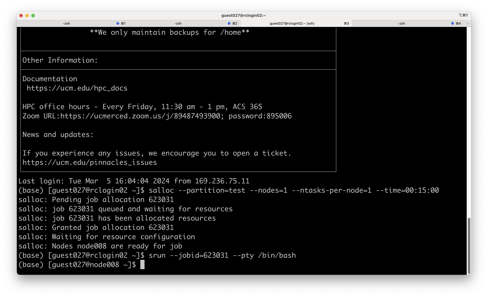

import Tag from '@site/src/components/Tag';
import Tabs from '@theme/Tabs';
import TabItem from '@theme/TabItem';


## Running Jobs on Clusters

The command `sbatch` is used to submit jobs to the queue. Additional commands to work with and monitor the queue/scheduler are shown in the table below.


|Command|Description|
|--|--|
|squeue|reports the state of jobs or job steps.|
|sinfo|reports the state of partitions and nodes managed by Slurm|
|scancel|used to cancel a pending or running job or job step. It can also be used to send an arbitrary signal to all processes associated with a running job or job step.|

<Tabs>

  <TabItem value="Pinnacles" label="Pinnacles" default>
    ```bash
    #!/bin/bash
    #SBATCH --nodes=1    # request only 1 node
    #SBATCH --partition test      # this job will be submitted to test queue
    #SBATCH --mem=96G #this job is asked for 96G of total memory, use 0 if you want to use entire node memory
    #SBATCH --time=0-00:15:00 # 15 minute
    #SBATCH --ntasks-per-node=56 # this job requests for 56 cores on a node
    #SBATCH --output=my_%j.stdout    # standard output will be redirected to this file
    # #SBATCH --constraint=bigmem   #uncomment this line if you need the access to the bigmem node for Pinnacles
    # #SBATCH --constraint=gpu #uncomment this line if you need the access to GPU
    # #SBATCH --gres=gpu:2   #uncomment this line if you need GPU access (2 GPUs)
    #SBATCH --job-name=my_job    # this is your job’s name
    ##SBATCH --mail-user=UCMercedNetID@ucmerced.edu  
    ##SBATCH --mail-type=ALL  #uncomment the first two lines if you want to receive     the email notifications
    #SBATCH --export=ALL
    ```
     </TabItem>

    <TabItem value="MERCED" label="MERCED">

      ```bash
      #!/bin/bash
      #SBATCH --nodes=1    # request only 1 node
      #SBATCH --partition test      # this job will be submitted to test queue
      #SBATCH --mem=96G #this job is asked for 96G of total memory, use 0 if you want to use entire node memory
      #SBATCH --time=0-00:15:00 # 15 minute
      #SBATCH --ntasks-per-node=56 # this job requests for 56 cores on a node
      #SBATCH --output=my_%j.stdout # standard output will be redirected to this file
      # #SBATCH --constraint=bigmem#uncomment this line if you need the access to the bigmem node for MERCED
      #SBATCH --job-name=my_job    # this is your job’s name
      ##SBATCH --mail-user=UCMercedNetID@ucmerced.edu  
      ##SBATCH --mail-type=ALL  #uncomment the first two lines if you want to receive     the email notifications
      #SBATCH -M merced
      #SBATCH --export=ALL
      ```
    </TabItem>

    </Tabs>


Note that for both MERCED and Pinnacles CPUs **hyper-threading** is turned off.  
> If you want to assess how busy the cluster is, please use the following
Use `sinfo` to see the nodes state and check how many nodes are being allocated (alloc) or how many nodes are available (idle)
> If you want to estimate the job starting time 
`sacct -X -j [JOBID] -o start,submit` provides information for job estimated starting time or submitted time


## Job Arrays 
Job arrays offer a mechanism for submitting and managing collections of similar jobs quickly and easily that utilizes only one job script. Submitting a job array can be useful in many of the following ways: 

1. Having a set of code or program that needs to run many different input variables or files. 
2. Running a single program repeatedly to analyze a single data file.
3. Running the same program multiple times with varying parameters.

Job arrays allows users to run jobs at the same time or have the results of the previous job output to be used as input for the next job. While the output capacity from a job array is immense, the job configurations are the same for all jobs to be run in the job array. 

The max number of jobs that can run at the same time is determined by the maximum number of jobs that can run on the selected partition and is different for each partition.< RETURN HERE TO ATTACH PARTITIONS>

## Job Array Scripting
<Tabs>

  <TabItem value="Job Array Sample Script" label="Job Array Sample Script" default>
    ```bash
    #!/bin/bash
    #SBATCH --nodes=1  #asked for 1 node
    #SBATCH --ntasks=1 #asked for 1 cores
    #SBATCH --partition medium  #this job will submit to medium partition
    #SBATCH --array=1-5
    #SBATCH --mem=1G  #this job is asked for 1G of total memory, use 0 if you want to use entire node memory
    #SBATCH --time=0-00:15:00 # 15 minutes
    #SBATCH --output=test_%A_%a.qlog  #the output information will put into test_$SLURM_ARRAY_JOB_ID_$SLURM_ARRAY_TASK_ID.qlog file
    #SBATCH --job-name=test1  #the job name
    #SBATCH --export=ALL
    whoami
    module load anaconda3
    # This job will use one python input but takes different argument each time per job array
    python3 python_test_array.py $SLURM_ARRAY_TASK_ID
    ```
  </TabItem>
</Tabs>

### Submitting and Managing Job Arrays

When submitting a job array there will be a new argument, ` --array=x-y`. The task id,`x` represents the starting index, and  the task id `y` represents the last index - 1. The complete line to submit the array job will look similar to `#SBATCH --array=x-y myjob.file`. Where `myjob.file` will be replaced by the name of your job script. 

The Task ID range specification arguments can also be configured to:

1. Submit a job array with specified-comma separated index values. Ex. `#SBATCH --array=6,36,1296`. (6, 36 1296): total of 3 jobs.
2. Submit a job array with index values incrementing by 1. Ex. `#SBATCH --array=x-y` Range from 1-10; total of 10 jobs. 
3. Submit a job array with index values that have a step or parse value that does not equal 1. Ex. `#SBATCH --array=45-90:15`. Range from index 45-90, with an step of 15 (45,60,75,90). Total of 4 jobs to be ran. 

### Job Dependencies in Job Arrays
Jobs that depend on outputs of previous jobs of a job array or on the output of a whole job array after it is completed must declare itself as dependent using `#SBATCH --depend=<Flag>:[jobid][IndexRange] <jobscript.file>` after the independent job array has been submitted to the scheduler. 

Below are flags that can be used to help declare the dependency of certain job(s) in the job array submission line after the first job array has been submitted to the scheduler. 

|Command | USE |
| --------| --------------- |
| after  | Flag is satisfied after all tasks in the job array start. | 
| afterany | Flag is satisfied after all tasks in the job array complete.|
| aftercorr | Satisfied after the corresponding task ID in the specified job has completed successfully | 
| afterok  | Flag is satisfied after all tasks in the job array complete successfully | 
| afternotok | Flag satisfied after all tasks in the job array complete with at least one tasks not completing successfully. | 

## Running Interactive Jobs 
Interactive jobs are a useful way to debug and test code with small sample inputs before submitting a scaled up batch job. Interactive jobs allows users to allocate resources and work on a node directly, seeing any errors or outputs in real-time as the program builds, compiles and executes.

Interactive jobs can be observed as a two-part process:
1. Requesting the resources.
2. Entering the requested resources to run programs.


Below will be a demonstration about running an interactive job
### Requesting an Interactive Jobs
To start an interactive session: the `salloc` command allocates resources for the interactive job. Once the resources are allocated the `srun` command will be used to enter the compute node configured for the interactive node.
``` bash 
# salloc command example structure
salloc --partition=<queue> --nodes=<#> --ntasks-per-node=<#> --time=<time>

#salloc command example - Request 1 Node, 1 core and for a time of 15 mins on test partition
salloc --partition=test --nodes=1 --ntasks-per-node=1 --time=00:15:00

#salloc command can also be used with constraints!

#Example of interactive job command for GPU Usage - 1 Node with 2 GPUs for 15 minutes on gpu partition
salloc --partition=gpu --nodes=1 --gres=gpu:2 --time=00:15:00

#Example of interactive job for big mem node 
salloc --partition=bigmem --nodes=1 --ntasks-per-node=1 --constraint=bigmem --time=00:15:00
```


### Entering the Interactive Compute Node <!-- {docsify-ignore} -->
To enter the interactive session: the `srun` command will initiate the job step under the allocated job with the provided job id.
```bash 
# srun command template 
srun --jobid=[jobid] --pty /bin/bash

# srun command example
srun --jobid=100234 --pty /bin/bash

```
:::info 
Ensure to replace the [jobid] with the jobid that will be outputted by the `salloc` command.
:::

In the above example of `srun` we ask to placed on the resources allocated to us earlier. Refer to the visual example below.

Once, successfully entered the interactive compute node, you will notice that your current ssh login wil change from rclogin to a compute node as seen in the figure below.

#### Example Visualization of Complete Process 



Ex.
   [guest027@`rclogin02` ~] will change to [guest027@`node008` ~] reflecting a node placement change onto the compute node, `node008`. Placement on a compute node now allows for more intensive build, compile and computations. 

:::danger
Always ensure you are on the compute node before running experiments! You will cause disruptions if you are running computationally intensive tasks on a  login node.
:::
#### Ending the Interactive Session 


:::info It's important to release the allocated resources after usage.
:::

To properly exit use one of the following methods:
- If you're logged into the node directly, simply type exit or press Ctrl+c to log out. 
- If you used srun to run commands, you can exit the shell spawned by srun to return to your original session, and then use exit or Ctrl+D.
- To explicitly release the resources, you can use the scancel command with your job ID, which can be found using squeue.

!>  Using one of these methods, you must still use `scancel [jobid]` to release the resources after you exit the node.
#### Useful Tips and Tricks for Interactive Session 
1. Ensure your connection remains active to the node during your allocated resource time. If at any point, connection to the node is lost, the running calculations may be interrupted abruptly.
2. Use interactive sessions only for testing of programs on the smaller scale that can be scaled up in a batch job. Interactive sessions are not best used when running longer, more computationally intensive programs.
3. Request Only What is Needed: To ensure efficient use of cluster resources, request only the amount of time, memory, and compute resources necessary for your task.
4. Always check you are currently placed on the compute node before running any experiments. For any reason you are not on the compute node and begin running experiments you may cause massive disruptions to all users on the login nodes.

