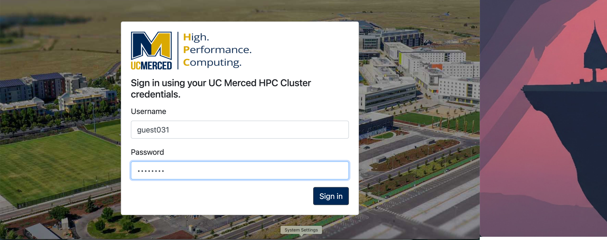
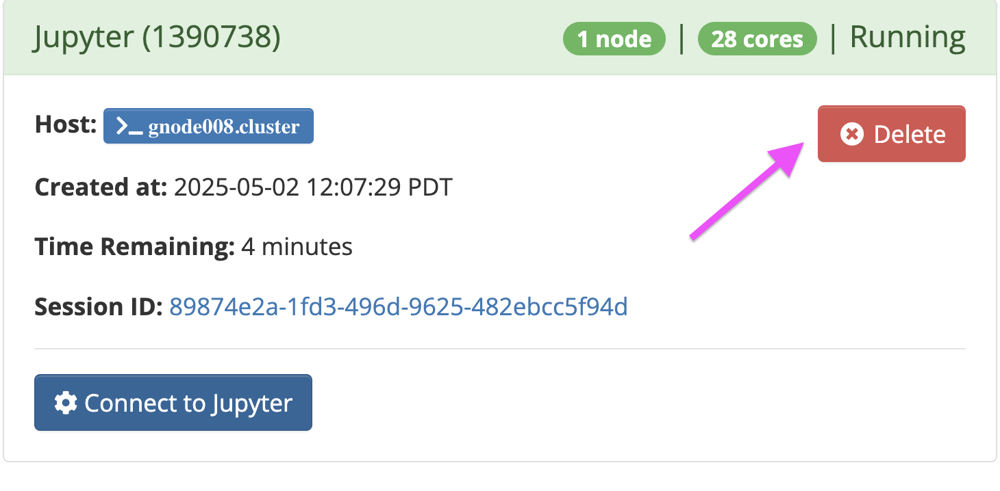

#### Quick Summary
:::info
This page presents information on Open OnDemand Use and Best Practices 
This page aims to offer in-depth walkthrough and tutorials relating to the use Open OnDemand for the MERCED and Pinancles Cluster
:::

# Introduction to OOD

We are happy to introduce Open OnDemand (OOD) support for Pinnacles and MERCED Clusters!

## Accessing OOD 
To access Open OnDemand please access using the following link: [https://ondemand.rc.ucmerced.edu](https://ondemand.rc.ucmerced.edu)

The Login page will require you to authenticate with your username and password that were given to the user by the CIRT team. Typically the username will be the same as your UCM NetID, but the password will be a password that you chose. 

Open OnDemand is a web front‑end that lets you interact with both the **Pinnacles** and **MERCED** clusters without having to interact with command line. Think of it as an HPC “control center” — upload files, open a shell, launch Jupyter Lab or VS Code, monitor jobs, and even check your disk usage, all from a browser.

## Logging into the Web GUI
>  **URL:** [https://ondemand.rc.ucmerced.edu](https://ondemand.rc.ucmerced.edu) 

:::warning
For users logging into for the first time, please sign in via the terminal, showcased here, to properly reset the default password. 
:::

## Home Page 

| Location                  | Purpose                                                                                                                                    |
| ------------------------- | ------------------------------------------------------------------------------------------------------------------------------------------ |
| **Files**| Access all your files in view mode that are on the cluster. This can also render images in the browser.                                    |
| **Clusters**| Quickly enter shell mode.      |
| **Interactive Apps**| Holds the list interactive apps that are currently supported such as Matlab, Mathematica, STATA and other code hosting such as Jupyterhub. |
| **Settings**| Signout procedure is here.                                                                                                                 |
| **Recent Jobs**| Last few Slurm jobs you submitted, with states and exit codes.                                                                             |
| **Storage** | **scratch** and **data** bars showing GB used / quota (red = near limit).                                                                  |
| **Announcements**    | Campus or RC‑wide notices (e.g., downtime, workshops, call‑for‑posters).    |
| **System Status**   | Node availability for each partition; utilization gauge.    |

## Showcase: Launching Jupyterhub

Jupyter is one supported that is via interactive session where the user can try run Python code with different custom and personalized Anaconda environments interactively and not have worry about setting up SLURM submission scripts and get results back in real time. 

:::warning
Ensure to end the interactive session by clicking `Delete`. Example Screenshot is below

Once the job is done it will enter the `Complete` state. 
:::

## Showcase: Launching Matlab
Matlab is one supported that is via interactive session where the user can try run matlab code interactively and not have worry about setting up SLURM submission scripts and get results back in real time. 

