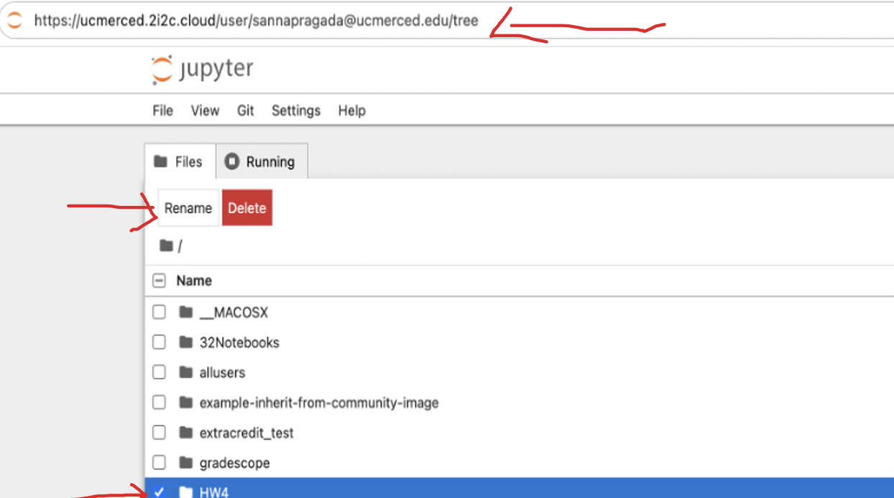

# Troubleshooting nbgitpuller

You may run into different types of errors when you are using the JupyterHub or Jupyter notebooks. The majority of errors come from a few common causes and can be solved using the following methods.

## nbgitpuller Link Errors <!-- {docsify-ignore} -->

nbgitpuller link errors are usually due to one of three issues:

### 1. The nbgitpuller link was clicked in an incompatible browser (Microsoft Edge) <!-- {docsify-ignore} -->
Unfortunately, the nbgitpuller software does not support the Microsoft Edge browser. If you click an nbgitpuller link in Edge, you will likely be taken to your datahub.berkeley.edu dashboard, but you won't see your desired files there. 

Solution: open nbgitpuller links in Chrome, Firefox, or Safari

### 2. The nbgitpuller link was generated incorrectly <!-- {docsify-ignore} -->
If the nbgitpuller link was not generated correctly, you'll see a red loading bar with an error message that says "Error: Command '['git', 'fetch']' returned non-zero exit status 128." An example screenshot is below:


Solution: re-generate the nbgitpuller link. Make sure that you've filled in the correct Jupyter hub URL, Github URL, branch, and file. Some tips:
* URLS should NOT end with forward slashes. "https://github.com/arpeltzer/su24Math032" is okay; "https://github.com/arpeltzer/su24Math032/" will break
* The Git repository url should go to the base repo that contains the materials you want. For example, if you want to link to the "lab01.ipynb" in the su24Math032 repository, the Git URL should be "https://github.com/SaiUCM/su24Math032", not "https://github.com/SaiUCM/su24Math032/blob/master/lab01"
* The File to Open needs to include the full path of the file from the base repository. For example, if the "lab01" file is in a folder called "labs", the File to Open needs to be "labs/lab01"

### 3. The nbgitpuller link has been used before, and some of the content was changed in both JupyterHub and Github <!-- {docsify-ignore} -->
If you make changes to an assignment on Github after students have started working on it, students that click the nbgitpuller link again may see a red loading bar and a message about a *merge conflict*. This occurs if the instructor and the student both change the same parts of the notebook: nbgitpuller doesn't know how to integrate the instructor's changes without overwriting student work, so it refuses to proceed. You can read [more about nbgitpuller's automatic merging behavior here](https://jupyterhub.github.io/nbgitpuller/topic/automatic-merging.html).

### Solution: <!-- {docsify-ignore} -->

The easiest and most conservative solution is to rename the file or folder that contains the incompatible changes, then click the nbgitpuller link again. If the file or folder is renamed to anything else (e.g. "SOC-5-old"), nbgitpuller will clone a fresh copy of the problematic files to the student's Jupyterhub. They can then copy over any work from the old version of the file.

When you face an error like below, do the following steps


- Rename the existing folder where the merge conflict error arose


Here is the steps required to rename the folder!

- Click on the nbgitpuller link again
- Use the newly cloned repository created after nbgitpuller link was clicked


The best advice, however, is to avoid making changes to assignments once they've been released to students if at all possible.

### How can I view all the attributes or methods available for an object in Python in the Jupyterhub? <!-- {docsify-ignore} -->

To explore all the available attributes or methods of an object in Python within a JupyterHub environment, follow these steps:
 - a. **Import the Module**:Start by importing the module that contains the object you're interested in. For example, to work with the math module, you would import it with:
 - b. **Use the Tab Key for Auto-completion**: Type the name of the module or object followed by a period (.) in a new cell or the same cell. Then, press the "Tab" key on your          keyboard.
 
 
 
### How do I ensure Plotly charts render correctly in Jupyterhub? <!-- {docsify-ignore} -->

Ensure that you include this line in your notebook for Plotly to function properly. Referring to the documentation at 
[Plotly Renderers](https://plotly.com/python/renderers/), there are two methods to achieve this:

Import the `io` method from Plotly in your import statement: `import plotly.io as pio`, and specify the desired renderer using `pio.renderers.default = "iframe"`. 
   
   
```python
   import plotly.io as pio
   pio.renderers.default = "iframe" 
   
```
Alternatively, directly specify the renderer in the fig.show() method by using fig.show(renderer='iframe').


