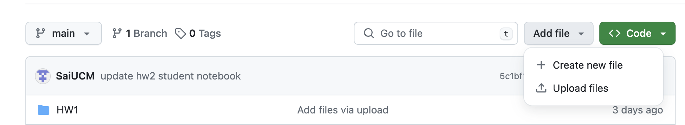
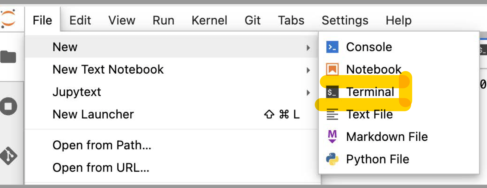
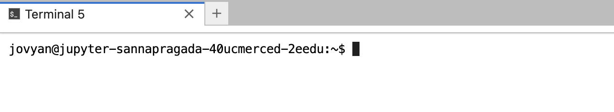

# Uploading Files to GitHub <!-- {docsify-ignore} -->

### What are Git and GitHub? <!-- {docsify-ignore} -->

Git is a version control software that tracks changes in files and allows multiple users to work on the same files in parallel smoothly. Git is often used in conjunction with GitHub, a website that hosts code and files. A repository \(aka repo\) on GitHub holds the files for a specific project. GitHub’s web interface also displays the information that Git tracks, such as which users are working on a file and what changes have been made to the file.

### Why should I store materials on GitHub? <!-- {docsify-ignore} -->

Storing materials on the GitHub allows you to use interact links for assignment distribution. It's also allows you to use the version control features that Git provides. Most connector courses have a public and private repo for their courses in the data-8 GitHub organization, which acts a centralized location for the material across semesters.

### Using the Web Interface <!-- {docsify-ignore} -->

You can perform many actions such as uploads and downloads directly through GitHub's web interface directly, without having to use the command line interface. Here are some directions on how to upload assignments to GitHub. If you did your development on JupyterHub, download the notebook onto your computer. Then, go to your connector's GitHub repository and click `Upload Files` on the right side.

<!-- 

  

 -->

You can drag and drop your desired files onto the page. Then, write a short sentence describing the files you're adding. This short sentence is called a commit message.

<!-- 

  

 -->

You will then see an option to select the branch for your changes. The default for most repositories will be the `master` branch. If you are a Git beginner, you can stick to the default and add your changes to the `master` branch. If you are a more advanced Git user and want to use different branches, you may want to select the option to create a new branch. Please see the additional GitHub resources on this page to learn more about branching.

<!-- 

  

 -->

Once you've gone through the above steps, you can save your changes. A set of changes in Git is called a commit.

### Using the Command Line <!-- {docsify-ignore} -->

GitHub can also be used via the command line. We will not go into the details of how to use Git in this guide as there are many online resources on this topic. One resource for using Git over the command line is linked at the bottom of this page.

You can store your connector's Git repository locally and use a local terminal application to access the command line. You can also store the repository on datahub.berkeley.edu and use the terminal that is present on the JupyterHub. You can access the terminal on JupyterHub by clicking on the `New` dropdown, and then clicking on `Terminal`.

<!-- 

  

 -->
You will then see a terminal page in the browser.

<!-- 

  

 -->

### Additional Resources <!-- {docsify-ignore} -->

##### **Web Interface** <!-- {docsify-ignore} -->

* [Managing Files](https://help.github.com/categories/managing-files-in-a-repository) - contains information under the "Managing Files on GitHub" section on how to perform many basic file operations using the GitHub web interface.

* [Hello World Exercise](https://guides.github.com/activities/hello-world) is a short exercise that walks you through additional GitHub features such as branches and pull requests.

##### Command Line <!-- {docsify-ignore} -->

* [Atlassian Tutorials](https://www.atlassian.com/git/tutorials\) - tutorials for different levels of Git Users.

##### Desktop GUI <!-- {docsify-ignore} -->

* [Desktop GUI site](https://desktop.github.com/\) - information on using a GitHub desktop GUI.

## Distributing Assignments

### nbgitpull <!-- {docsify-ignore} -->

You’ll often want to distribute content (such as notebooks, scripts, sample data, etc.) to your users so they can do exercises, follow along with a lecture, or use as a starting point for their own work. This content is often constantly updated as time goes on, and needs to not overwrite your student’s work if you make an adjustment to content that has already been touched by the student. That’s where nbgitpuller comes into the picture.

nbgitpuller is already installed in the default environment for UCMerced JupyterHubs. To set up a nbgitpuller link, users must have a GitHub account. The following are the steps which will guide you to create an nbgitpuller link

[Generate nbgitpuller Link](https://ucm-it.github.io/hpc_docs/#/jupyterhub?id=generate-nbgitpuller-link)

Users can generate an nbgitpull link using the tool [nbgitpuller](https://nbgitpuller.readthedocs.io/en/latest/link.html) link, which will look like in the following screenshot:

