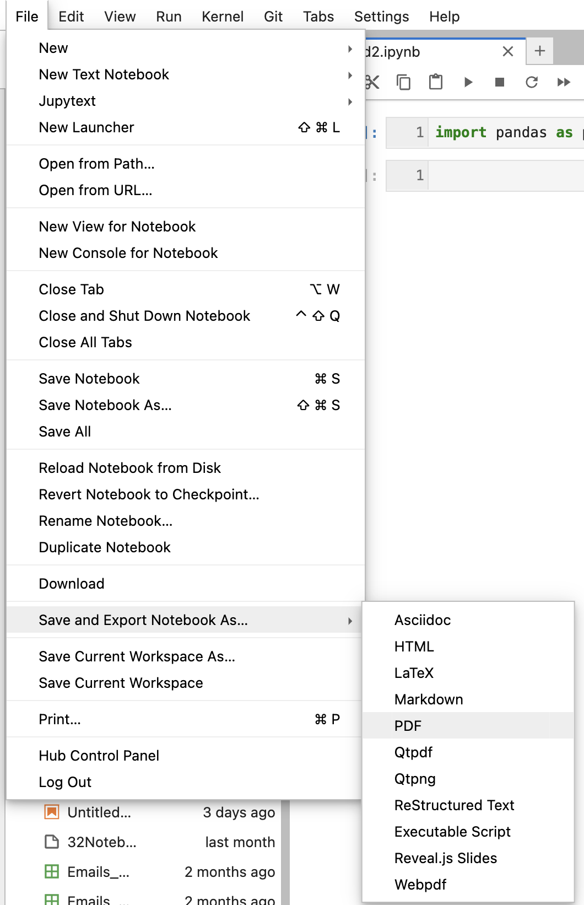

<!-- ### Onboarding new users to the Hub -->

**I am instructor planning to teach using Jupyterhub. How do I onboard myself?**

Dear Instructor, Sharing few logistical information which would make onboarding easy for you.Please follow this documentation to onboard a User to Jupyterhub.

- Documentation: You can also refer to the FAQ section of this support documentation (Curriculum Guide), where we regularly update solutions to some of the reported issues.
 
- Packages: Check whether all the needed Python/R packages and their required versions are installed in Jupyterhub.The Procedure for package installation varies across different programming languages. Basic python packages such as numPy, pandas, scikit-learn, matplotlib, etc., are installed across the Jupyterhub.It also supports R packages such as shiny, dplyr, tidyR, RSQLlite, etc. Here is the list of  [Python Packages](https://ucmerced.app.box.com/s/x2eigcssqyeca9mrid3m19glfcs73j02) installed in [ucmerced.2i2c.cloud](https://ucmerced.2i2c.cloud/hub/login) . Here is the list of [R packages](https://ucmerced.app.box.com/file/1481528927192?s=65r1rda9atblpdsxdvtyaq6exlnns9z3) installed in [ucmerced.2i2c.cloud](https://ucmerced.2i2c.cloud/hub/login)

If you require a permanent solution then you need submit a [UCMerced Service Hub](https://ucmerced.service-now.com/servicehub?id=public_kb_article&sys_id=3c3ee9ff1b67a0543a003112cd4bcb13&form_id=06da3f8edbfc08103c4d56f3ce9619f4) to us to install the required package(s) in Jupyterhub.


**How can I learn more about Jupyterhub to onboard myself?**

If you are new to Jupyterhub and want to know more, refer [here](https://ucmerced.2i2c.cloud/hub/login). 


**What languages are supported by the JupyterHub?** <!-- {docsify-ignore} -->

Jupyterhub primarily supports three languages - **Python, R**.


**What is the default Memory/CPU requirement for every hub?** <!-- {docsify-ignore} -->

Jupyterhub has a memory limit of 2GB of RAM, which should meet the teaching needs of most of our users. If you are interested to know more about the memory consumption in your instance, Please use the following steps,

Look at the top right corner of your Python/R notebook for the term memory. It will highlight the amount of memory you had consumed by the amount of memory provided to your instance. 


<!-- <div align="center" style={{ width: '100%' }}>
  
</div>
<br /> -->


**As an instructor what do I need to do to set up the hub for my course?** <!-- {docsify-ignore} -->

Honestly, nothing! You are free to use the Jupyterhub starting today. 

```{note}
We expect that all course members log in using their UC Merced email id. We also expect that you are using [nbgitpuller service](https://jupyterhub.github.io/nbgitpuller/link) to distribute materials to your class. We can help you set up the links so that you can distribute through your course website. 
```

**What instructions should I share with students at the start of the semester** <!-- {docsify-ignore} -->
Please ask your students,

- To download and backup their files at the end of semester.
- To refrain from installing python packages via `pip install --user`. Incase, if they install packages this way it may cause issues with launching their Jupyterhub. Best way to avoid this scenario is by installing packages by requesting them via [UCMerced Service Hub request](https://ucmerced.service-now.com/servicehub?id=public_kb_article&sys_id=3c3ee9ff1b67a0543a003112cd4bcb13&form_id=06da3f8edbfc08103c4d56f3ce9619f4)


**How do my students download their submissions as a PDF?** <!-- {docsify-ignore} -->
We recommend that you use the following options,
 
**For Jupyter Notebooks:** Select File -> Save and Export Notebook as -> PDF via HTML(.pdf) to get the PDF version of your notebook. 


<!-- <div align="center" style={{ width: '100%' }}>
  
</div>
<br /> -->

