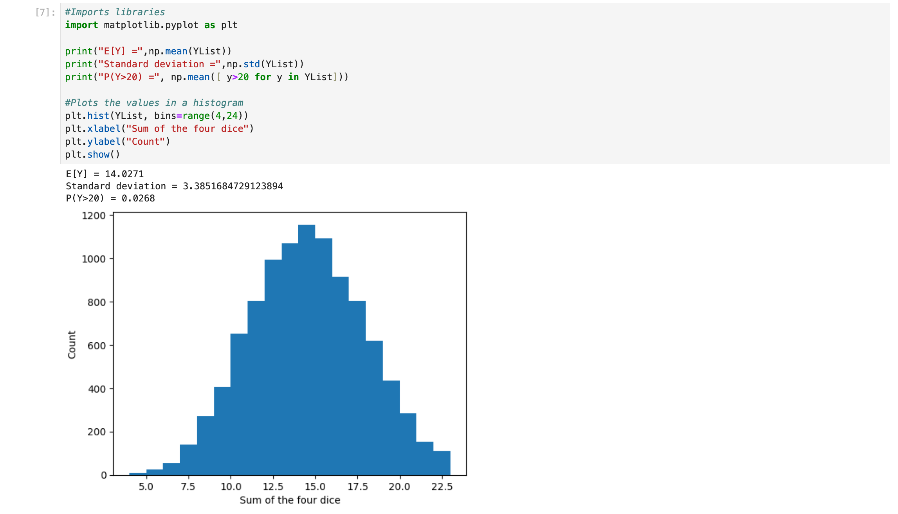

import cellsImg from '../hpcdocs/HPC-clusters/imgs/jupyter_cells.png';
import kernelImg from '../hpcdocs/HPC-clusters/imgs/kernel.png';
import menubarImg from '../hpcdocs/HPC-clusters/imgs/menubar.png';
import outputImg from '../hpcdocs/HPC-clusters/imgs/output_area.png';

<!-- // ## Getting started about the Campus Jupyterhub -->

## Pedagogy and Technology
To ensure our courses are accessible to students of all majors, we aimed to use technology that is both simple and powerful. We wanted to eliminate the frustrations commonly associated with setting up and maintaining a development environment, often encountered in introductory computing courses.Students can start writing and running code immediately, without wasting time on installation or setup.

### JupyterNotebooks? <!-- {docsify-ignore} -->

Jupyter Notebook is an open-source web application that allows you to create and share documents that contain **live code**, equations, visualizations, and narrative text. Uses include data cleaning and transformation, numerical simulation, statistical modeling, data visualization, machine learning, and much more.

### JupyterHub Packages/Libraries <!-- {docsify-ignore} -->

In addition to UC Merced’s JupyterHub computing infrastructure, another key educational component is the integrated Python packages.
These packages are designed to fit the main use cases for most students. We have libraries perfect for STEM majors including Pandas, Numpy, MatPlotLib, SciPy, Scikit-learn, pytorch, Jupyter's incorporated packages, etc. A core component of the JupyterLab is the ease of access and instantaneous set-up, with the ability to boot up and environment and starting coding without waiting! This package set focuses on students' needs and accessibility, while prioritizing efficiency as well. If these libraries and packages do not fit your needs we have the [Pre-installed Packages and Libraries Page ](/docs/jupyter/packages) which lists all the major packages and more general information. 

## Introduction to Jupyter <!-- {docsify-ignore} -->

### JupyterNotebooks?
Jupyter Notebook is an open-source web application that allows you to create and share documents that contain **live code**, equations, visualizations, and narrative text. Uses include data cleaning and transformation, numerical simulation, statistical modeling, data visualization, machine learning, and much more.

### Features <!-- {docsify-ignore} -->

  - **Interactive Environment:** Jupyter Notebooks provide an interactive computing environment where users can write and execute code in a step-by-step manner.
  - **Support for Multiple Languages:** While originally designed for Python, Jupyter Notebooks support various programming languages like Julia, Python, and R.
  - **Rich Output:** Notebooks allow the incorporation of rich media outputs such as plots, images, videos, and interactive widgets alongside code and text cells.
  - **Markdown Support:** In addition to code cells, users can include Markdown cells to write formatted text, equations (using LaTeX syntax), and even HTML for documentation or explanations.
  - **Data Visualization:** Using libraries like Matplotlib, Seaborn, users can create interactive and static visualizations directly within the notebook environment.
  - **Integration with Libraries and Tools:** Jupyter Notebooks seamlessly integrate with various data science libraries and tools such as NumPy, Pandas, SciPy, TensorFlow, and scikit-learn.

### Components <!-- {docsify-ignore} -->

**Cells:** Notebooks are composed of individual cells that can contain either code, Markdown-formatted text, or raw content. Users can execute code cells and render Markdown cells to produce outputs. 

<!-- old image link: 

 -->

  

**Kernel:** Each notebook is associated with a computational kernel, which is responsible for executing code within the notebook. Different kernels support different programming languages. 

<!-- old image link: 

 -->

  

**Toolbar:** The toolbar provides quick access to common actions such as running cells, saving the notebook, adding new cells, and changing cell types. 

<!-- This image does not need to be resized -->

**Menu Bar:** The menu bar contains various options for manipulating the notebook, managing kernels, and configuring the notebook environment. 

<!-- old image link: 

 -->

  

**Output Area:** Code cells display their output, including text output, error messages, and visualizations, in the output area directly below the cell. 

<!-- old image link
  -->

  

**File Format:** Notebooks are saved in a JSON file format with the `.ipynb`

### Using Jupyter Notebooks for Data Analysis <!-- {docsify-ignore} -->

**Jupyter Notebooks** are incredibly versatile for **data analysis** projects. They allow data scientists to combine **executable code**, rich text, **visualizations**, and equations in a single document.

- **Interactive Data Exploration:** Notebooks facilitate interactive exploration of datasets, enabling quick iterations over a data preprocessing or analysis pipeline.
- **Visualization:** With support for libraries like **Matplotlib** and **Seaborn**, users can create and embed graphs directly within notebooks.
- **Collaboration and Sharing:** Notebooks can be easily shared between users, promoting collaboration on data analysis projects.

### Why does JupyterHub Exist? <!-- {docsify-ignore} -->

[Jupyterhub](https://jupyter.org/hub) is an open source tool that lets you host a distributed Jupyter Notebook environment. With JupyterHub, users can log in to the server, and write Python,R code in a web browser, without having to install software on their local machine.

Working on JupyterHub provides a number of benefits, especially in an introductory course:

Students never have to do any setup or installation. JupyterHub removes the burden of setting up and maintaining a development environment.

All students and instructors use the same computing environment.

Work stored in the cloud and can be accessed from any computer.

All students have access to the same compute power, regardless of the machine they are using. For example, students without personal computers can use publicly shared computers(i.e. library computers) without being at a disadvantage in the course.

### Differences from local installation <!-- {docsify-ignore} -->

| **JupyterHub** | **Local Setup** |
| :--- | :--- |
| Needs an internet connection | Does not need an internet connection |
| Limited resources \(disk and RAM\) | Unlimited resources \(limited only by your computer\) |
| System-wide installation done by admins | You can install anything you want |
| You can only access files in your account | You can maybe access all files \(if you are an admin\) |
| If things break, we fix them :\) | If things break, you have to fix them :\( |

### Overview of the Internals <!-- {docsify-ignore} -->

The first time you logs in to JupyterHub, a personal account is created for you. You will get your own filesystem so you only have access to the files in your personal account. **Modifications to files in your personal account do not affect anyone else's files.** Unless you are an admin, you cannot access another account's files. This applies to everyone working on JupyterHub, which means a given student cannot access another student's work.