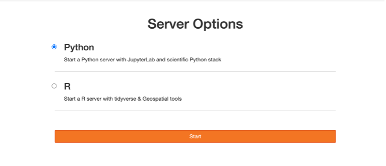
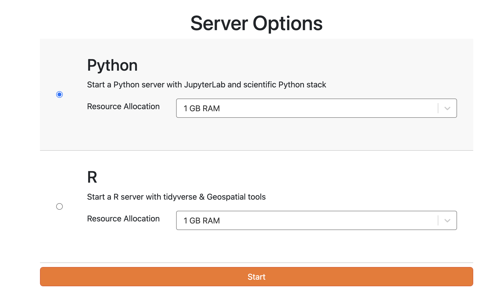
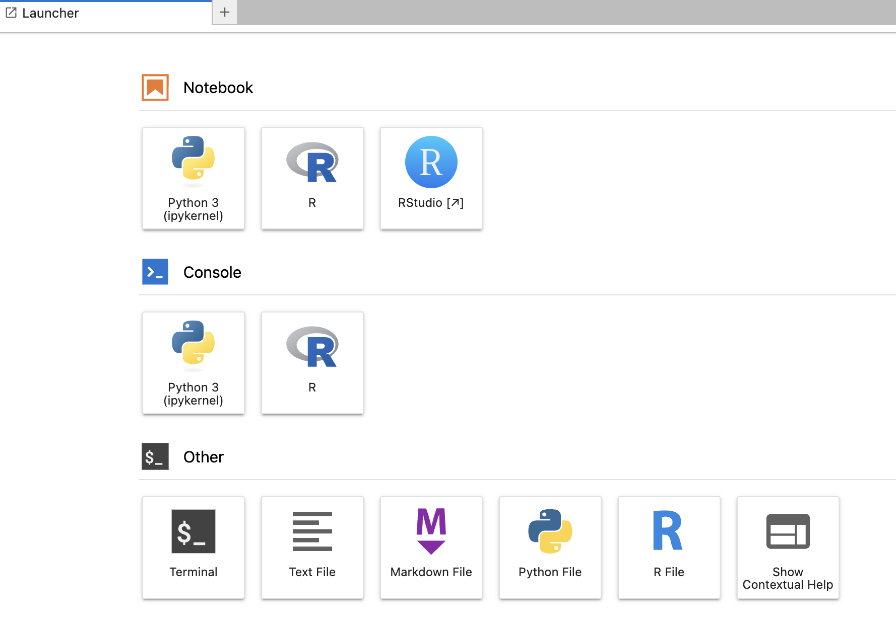
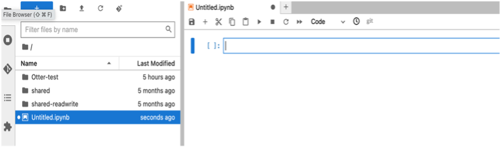

## Creating assignments

#### Choose Server: <!-- {docsify-ignore} -->

Select the server that best suits your needs by clicking on the corresponding option. For example, you might choose between a Python server and an R server.

<!-- 

  

 -->

#### Start Server: <!-- {docsify-ignore} -->

Once you've made your selection, Choose the appropriate amount of RAM based on your assignment or task.click on the option to start the server. This will initiate the server and provide you with access to the chosen environment. 

<!-- 

  

 -->

By following these steps, you can start the server on the UCMerced **JupyterHub** and begin working within your preferred environment. The folder structure will vary depending on the user's access level, whether they are an administrator or a regular user.

<!-- 

  

 -->

### How can I switch from a Python server to an R server in JupyterHub? <!-- {docsify-ignore} -->
**Navigate to the Hub Control Panel**: First, locate and click on the "File" menu at the top of your JupyterHub. From the dropdown options, select "Hub Control Panel" to access the control panel for your JupyterHub environment.

<!-- 

  

 -->

**Stop the Current Running Server**: In the Hub Control Panel, you will see an option to "Stop My Server." Click this option to halt the currently running server. It's necessary to stop the current session before you can switch to a different server or kernel.

<!-- 

  

 -->

**Start a New Server**: After stopping your server, you'll be redirected to the JupyterHub home page or you might need to navigate back to it manually. Here, click on the "Start My Server" button to initiate the process of starting a new server.

<!-- 

  

 -->

**Select the R Server**: You will now be presented with a list of available servers or environments. Look for the option that corresponds to the R server (this might be labeled as "R," "IRkernel," or something similar depending on your JupyterHub's configuration). Select this option to proceed.

<!-- 

  

 -->

**Launch the Server**: After selecting the R server, click the "Start" button to launch a new JupyterHub session running on the R server. You're now ready to create and run notebooks using R.

<!-- 

  

 -->

### Create New Notebook <!-- {docsify-ignore} -->

From the Launcher, you can see different sections like:

- **Notebook**
- **Console**
- **Other**

Click the icon under the Notebook section to create a new notebook, which will be created with the name “Untitled.ipynb”.

<!-- 

  

 -->

### Rename Notebook <!-- {docsify-ignore} -->

To rename a notebook, you can simply right-click on the notebook from the Menu bar and choose the "Rename" option.

<!-- 

  

 -->

### Run Notebook <!-- {docsify-ignore} -->

To execute code within a notebook, users can click on individual code cells and then either press the "Run" button in the toolbar or press **Shift + Enter** on their keyboard.

### Add Code Block <!-- {docsify-ignore} -->

Users can add new code cells to their notebook by clicking on the "+" button in the toolbar and selecting "Code" from the dropdown menu.

### Add Markdown in Notebook <!-- {docsify-ignore} -->

To add Markdown text cells to a notebook, users should click the toolbar and select "Markdown" from the dropdown menu. They can then enter Markdown-formatted text into the cell. Once the Markdown cell is created, you can start typing your text directly into the cell.

<!-- 

  

 -->

The following are the different options you can use in markdown:

Use Markdown syntax to format your text. For example: 
    - Use `#` for headings (e.g., `# Heading 1` for a top-level heading).
    - Use `*` or `-` for bullet points.
    - Use `**` for bold text and `_` or `*` for italic text.
    - Use `` for adding links (e.g., `[link text](url)`).
    - Use `` ` `` for code snippets (e.g., `` `print("Hello world!")` ``).

<!-- 

  

 -->

**Note:** After typing your text, run the cell by pressing Shift + Enter. The Markdown cell will render your text in formatted style.

### Download Notebooks <!-- {docsify-ignore} -->

To download a notebook document, users can go to the "File" menu and select "Download as". From the submenu that appears, they can choose the desired file format (e.g., `.ipynb`, `.pdf`, `.LaTeX`, `.html`, `.webpdf`, `.qtpdf`, etc.) to initiate the download.

<!-- 

  

 -->